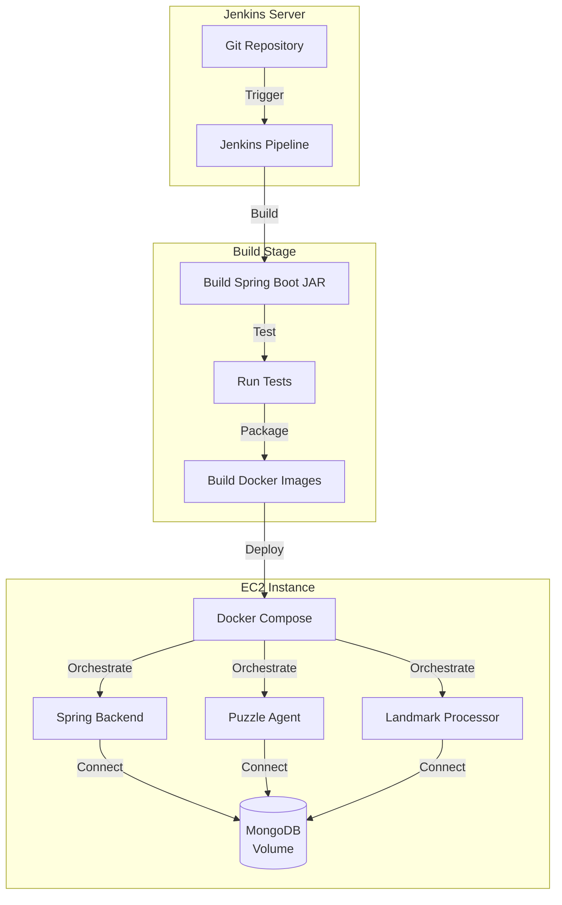

```mermaid
graph TB
    subgraph "Jenkins Server"
        J[Jenkins Pipeline]
        G[Git Repository]
    end

    subgraph "Build Stage"
        B1[Build Spring Boot JAR]
        B2[Build Docker Images]
        T[Run Tests]
    end

    subgraph "EC2 Instance"
        DC[Docker Compose]
        SB[Spring Backend]
        PA[Puzzle Agent]
        LP[Landmark Processor]
        M[(MongoDB<br/>Volume)]
    end

    G -->|Trigger| J
    J -->|Build| B1
    B1 -->|Test| T
    T -->|Package| B2
    B2 -->|Deploy| DC
    DC -->|Orchestrate| SB
    DC -->|Orchestrate| PA
    DC -->|Orchestrate| LP
    SB -->|Connect| M
    PA -->|Connect| M
    LP -->|Connect| M
```
