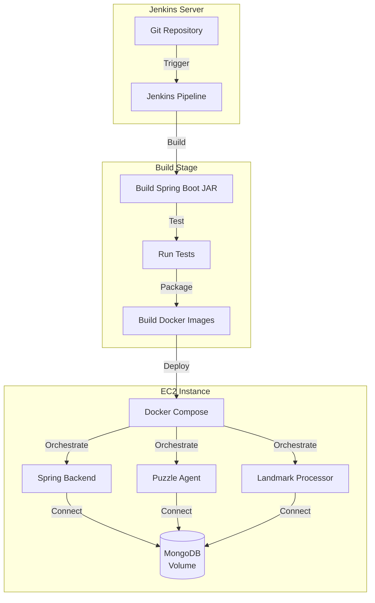

# ScavengerHunt 部署文档

## 架构概览

### CI/CD 架构（Jenkins）



### 生产环境架构

```
┌─────────────────────────────────────────────────────────────┐
│                    EC2 实例 (公网IP)                         │
│                                                              │
│  ┌──────────────────────────────────────────────────────┐  │
│  │  Nginx (443 HTTPS) - 反向代理                        │  │
│  └──────────────┬───────────────────────────────────────┘  │
│                 │                                           │
│  ┌──────────────▼──────────────────────────────────────┐  │
│  │  Docker Compose 网络: scavenger-net                  │  │
│  │                                                       │  │
│  │  ┌──────────────┐    ┌──────────────┐              │  │
│  │  │  MongoDB     │    │ Spring Boot  │              │  │
│  │  │  :27017      │◄───┤  :8080       │              │  │
│  │  │  (内部)      │    │  (内部)      │              │  │
│  │  └──────────────┘    │  暴露:8443   │              │  │
│  │         ▲            └──────┬───────┘              │  │
│  │         │                   │                       │  │
│  │         │                   ▼                       │  │
│  │  ┌──────┴──────┐    ┌──────────────┐              │  │
│  │  │PuzzleAgent │    │LandmarkProc. │              │  │
│  │  │  :5000     │    │  :5000       │              │  │
│  │  │(内部)      │    │(内部)        │              │  │
│  │  └────────────┘    └──────────────┘              │  │
│  └──────────────────────────────────────────────────────┘  │
└─────────────────────────────────────────────────────────────┘
         ▲                              ▲
         │                              │
    Web前端(浏览器)                移动端(React Native)
    HTTPS请求                      HTTPS请求
```

### 端口暴露说明

| 服务 | 容器内端口 | 外部暴露 | 是否对外暴露 | 用途 |
|------|-----------|---------|-------------|------|
| Nginx | - | 443 (HTTPS) | ✅ 是 | 对外HTTPS入口 |
| Nginx | - | 80 (HTTP) | ✅ 是 | HTTP重定向到HTTPS |
| Spring Boot | 8080 | 8443 (内部) | ❌ 否 | 仅Nginx内部访问 |
| MongoDB | 27017 | - | ❌ 否 | 仅内部访问 |
| PuzzleAgent | 5000 | - | ❌ 否 | 仅内部访问 |
| LandmarkProcessor | 5000 | - | ❌ 否 | 仅内部访问 |

---

## 手动部署完整步骤

### 阶段1：本地准备（在创建EC2之前）

#### 1.1 检查代码和依赖
- [ ] 代码已提交到Git（便于在EC2上clone）
- [ ] 确认MongoDB数据已备份（如果有数据）
- [ ] 准备OpenAI API Key

---

### 阶段2：创建并配置EC2

#### 2.1 创建EC2实例
- [ ] 在AWS创建EC2实例
  - 操作系统：Ubuntu 22.04 LTS
  - 实例类型：t3.medium或更大
  - 配置安全组：
    - SSH (22) - 仅你的IP
    - HTTP (80) - 0.0.0.0/0（用于HTTP重定向）
    - HTTPS (443) - 0.0.0.0/0（HTTPS访问）
    - HTTP (8443) - 临时开放，配置HTTPS后可以关闭
- [ ] 获取EC2公网IP（例如：`54.123.45.67`）

#### 2.2 连接到EC2并安装基础环境

```bash
# SSH连接到EC2
ssh -i ~/.ssh/your-key.pem ubuntu@<EC2_IP>

# 更新系统
sudo apt update && sudo apt upgrade -y

# 安装Docker
curl -fsSL https://get.docker.com -o get-docker.sh
sudo sh get-docker.sh
sudo usermod -aG docker ubuntu
newgrp docker  # 或重新登录

# 安装Docker Compose
sudo curl -L "https://github.com/docker/compose/releases/latest/download/docker-compose-$(uname -s)-$(uname -m)" -o /usr/local/bin/docker-compose
sudo chmod +x /usr/local/bin/docker-compose

# 安装Nginx（用于HTTPS反向代理）
sudo apt install nginx -y

# 安装Git
sudo apt install git -y

# 验证安装
docker --version
docker-compose --version
nginx -v
```

---

### 阶段3：在本地修改代码（使用EC2 IP）

#### 3.1 更新Web前端API地址

**在本地修改** `backend/src/main/resources/static/main.js`：

```javascript
// 第45行，修改为：
const LOCAL_HOST = "https://<EC2_IP>";  
// 例如：const LOCAL_HOST = "https://54.123.45.67";
```

#### 3.2 更新移动端API配置

**在本地修改** `mobile/utils/constants.ts`：

```typescript
export const API_BASE_URL = __DEV__ 
  ? 'http://192.168.1.9:8443'  // 开发环境
  : 'https://<EC2_IP>';  // 生产环境HTTPS
  // 例如：'https://54.123.45.67'
```

#### 3.3 修改docker-compose.yml（生产环境配置）

**在本地修改** `docker-compose.yml`，删除Flask服务的端口映射：

```yaml
# puzzle-agent服务中，删除或注释掉：
# ports:
#   - "5001:5000"

# landmark-processor服务中，删除或注释掉：
# ports:
#   - "5002:5000"

# MongoDB端口也可以删除（不暴露）：
# ports:
#   - "27017:27017"
```

**说明**：Spring Boot通过Docker网络内部访问Flask服务，使用容器名和内部端口，不需要暴露外部端口。

#### 3.4 提交代码到Git

```bash
# 在本地
cd /Users/grexrr/Documents/scavengerHunt
git add .
git commit -m "Update API URLs for production deployment"
git push
```

---

### 阶段4：在EC2上部署服务

#### 4.1 Clone代码到EC2

```bash
# 在EC2上
cd ~
mkdir -p scavengerhunt
cd scavengerhunt
git clone <your-repo-url> .
```

#### 4.2 创建Docker网络

```bash
# 在EC2上
docker network create scavenger-net
```

#### 4.3 配置环境变量

```bash
# 在EC2上
cd ~/scavengerhunt
cp env.template .env
nano .env  # 填写OPENAI_API_KEY
```

`.env`文件内容：
```bash
OPENAI_API_KEY=sk-your-actual-key-here
IMAGE_TAG=local
MONGO_URL=mongodb://mongo-scavenger:27017
MONGO_DB=scavengerhunt
FLASK_HOST=0.0.0.0
FLASK_PORT=5000
```

#### 4.4 在EC2上构建Docker镜像

```bash
# 在EC2上安装Java和Maven（如果还没有）
sudo apt install openjdk-21-jdk maven -y

# 构建Spring Boot镜像
cd ~/scavengerhunt/backend
mvn clean package -DskipTests
docker build -t spring-backend:local .
cd ..
```

**注意**：Flask微服务的镜像会在`docker-compose up`时自动构建（如果Dockerfile存在）。

#### 4.5 迁移MongoDB数据（如果有）

如果本地已有数据，使用volume迁移：

```bash
# 在本地执行
docker run --rm -v scavenger-mongo-data:/data -v $(pwd):/backup \
  alpine tar czf /backup/mongo-volume.tar.gz -C /data .

scp -i ~/.ssh/your-key.pem mongo-volume.tar.gz ubuntu@<EC2_IP>:~/scavengerhunt/

# 在EC2上执行
docker volume create scavenger-mongo-data
docker run --rm -v scavenger-mongo-data:/data -v $(pwd):/backup \
  alpine tar xzf /backup/mongo-volume.tar.gz -C /data
```

#### 4.6 启动服务

```bash
# 在EC2上
cd ~/scavengerhunt
docker-compose --env-file .env up -d

# 查看日志
docker-compose logs -f

# 检查服务状态
docker-compose ps
# 应该看到4个服务都在运行：
# - mongo-scavenger
# - spring-backend
# - puzzle-agent
# - landmark-processor
```

#### 4.7 验证HTTP服务（内部测试）

```bash
# 在EC2上测试
curl http://localhost:8443/actuator/health
# 应该返回: {"status":"UP"}

# 从外部测试（在本地浏览器）
# 访问: http://<EC2_IP>:8443/
# 访问: http://<EC2_IP>:8443/swagger-ui.html
```

---

### 阶段5：配置HTTPS（使用IP + 自签名证书）

#### 5.1 生成自签名SSL证书

```bash
# 在EC2上
sudo mkdir -p /etc/nginx/ssl

# 生成证书（替换<EC2_IP>为实际IP）
sudo openssl req -x509 -nodes -days 365 -newkey rsa:2048 \
  -keyout /etc/nginx/ssl/nginx-selfsigned.key \
  -out /etc/nginx/ssl/nginx-selfsigned.crt \
  -subj "/C=US/ST=State/L=City/O=Organization/CN=<EC2_IP>"

# 例如，如果EC2 IP是 54.123.45.67：
# -subj "/C=US/ST=State/L=City/O=Organization/CN=54.123.45.67"
```

#### 5.2 配置Nginx反向代理

创建配置文件：

```bash
# 在EC2上
sudo nano /etc/nginx/sites-available/scavengerhunt
```

配置文件内容（替换`<EC2_IP>`为实际IP）：

```nginx
# HTTP重定向到HTTPS
server {
    listen 80;
    server_name <EC2_IP>;
    
    location / {
        return 301 https://$server_name$request_uri;
    }
}

# HTTPS配置
server {
    listen 443 ssl http2;
    server_name <EC2_IP>;
    
    # 自签名证书路径
    ssl_certificate /etc/nginx/ssl/nginx-selfsigned.crt;
    ssl_certificate_key /etc/nginx/ssl/nginx-selfsigned.key;
    
    # SSL安全配置
    ssl_protocols TLSv1.2 TLSv1.3;
    ssl_ciphers HIGH:!aNULL:!MD5;
    ssl_prefer_server_ciphers on;
    
    # 反向代理到Spring Boot
    location / {
        proxy_pass http://localhost:8443;
        proxy_set_header Host $host;
        proxy_set_header X-Real-IP $remote_addr;
        proxy_set_header X-Forwarded-For $proxy_add_x_forwarded_for;
        proxy_set_header X-Forwarded-Proto $scheme;
        
        # 超时设置
        proxy_connect_timeout 60s;
        proxy_send_timeout 60s;
        proxy_read_timeout 60s;
    }
}
```

#### 5.3 启用Nginx配置

```bash
# 创建符号链接
sudo ln -s /etc/nginx/sites-available/scavengerhunt /etc/nginx/sites-enabled/

# 删除默认配置
sudo rm /etc/nginx/sites-enabled/default

# 测试配置
sudo nginx -t

# 启动Nginx
sudo systemctl start nginx
sudo systemctl enable nginx

# 检查状态
sudo systemctl status nginx
```

#### 5.4 更新安全组

- [ ] 确保443（HTTPS）和80（HTTP）已开放
- [ ] 可以关闭8443端口的外部访问（现在通过Nginx访问）

---

### 阶段6：移动端配置自签名证书（iOS需要）

**修改** `mobile/app.json`，添加iOS配置允许自签名证书：

```json
{
  "expo": {
    "ios": {
      "bundleIdentifier": "com.grexrr.scavengerhunt",
      "supportsTablet": true,
      "infoPlist": {
        "NSLocationWhenInUseUsageDescription": "Location access required for game",
        "NSLocationAlwaysAndWhenInUseUsageDescription": "Location access required for game",
        "NSAppTransportSecurity": {
          "NSAllowsArbitraryLoads": false,
          "NSExceptionDomains": {
            "<EC2_IP>": {
              "NSExceptionAllowsInsecureHTTPLoads": false,
              "NSExceptionRequiresForwardSecrecy": false,
              "NSIncludesSubdomains": true
            }
          }
        }
      }
    }
  }
}
```

**注意**：iOS会显示证书警告，用户需要在设备设置中手动信任证书。

#### 6.1 更新移动端配置

**在本地修改** `mobile/app.json`，添加iOS配置允许自签名证书：

```bash
# 在本地
cd /Users/grexrr/Documents/scavengerHunt/mobile
expo build:android  # 或 expo build:ios
```

---

### 阶段6：验证部署

#### 7.1 验证HTTPS访问

```bash
# 在本地浏览器测试（会有证书警告，点击"高级"→"继续访问"）
# 访问: https://<EC2_IP>/
# 访问: https://<EC2_IP>/swagger-ui.html
# 访问: https://<EC2_IP>/actuator/health
```

#### 7.2 验证移动端

- [ ] 安装移动端App
- [ ] iOS：首次访问会提示证书不受信任，需要在设置中信任证书
- [ ] 测试登录、位置更新等功能

---

## 重要说明

### 部署流程总结

**推荐流程**（更简单）：
1. 创建EC2 → 获取IP
2. **在本地修改代码**（API地址）→ 提交Git
3. 在EC2上clone代码 → build → 启动服务
4. 配置HTTPS（Nginx）

**关于代码修改**：

**不需要改的代码**：
- ✅ Spring Boot Java代码（后端逻辑）
- ✅ `application.properties`（Spring Boot配置）
- ✅ 微服务URL配置（Docker网络内部使用HTTP）

**需要改的代码**（在本地修改后提交Git）：
- ❗ `backend/src/main/resources/static/main.js` - Web前端API地址
- ❗ `mobile/utils/constants.ts` - 移动端API地址
- ❗ `docker-compose.yml` - 删除Flask端口映射（生产环境）
- ❗ `mobile/app.json` - iOS证书配置（如果需要）

### 关于自签名证书

1. **浏览器**：会显示"不安全"警告，需要手动点击"高级"→"继续访问"
2. **iOS App**：首次连接会提示证书不受信任，需要在设备"设置"→"通用"→"关于本机"→"证书信任设置"中信任证书
3. **Android**：相对宽松，但也会提示

### 通信流程

```
移动端/Web前端
    ↓ HTTPS请求
    https://<EC2_IP>/api/game/...
    ↓
Nginx (443端口，HTTPS)
    ↓ 反向代理（内部HTTP）
    http://localhost:8443/api/game/...
    ↓
Spring Boot (8443端口，HTTP，内部)
    ↓ 处理请求
    ├─→ MongoDB (内部)
    ├─→ PuzzleAgent (内部HTTP)
    └─→ LandmarkProcessor (内部HTTP)
    ↓ HTTP响应
Nginx
    ↓ HTTPS响应
移动端/Web前端
```

---

## 故障排查

### 容器无法启动

```bash
# 查看详细错误日志
docker-compose logs <service-name>

# 检查环境变量
docker-compose config

# 检查网络
docker network inspect scavenger-net
```

### 服务无法连接MongoDB

```bash
# 检查MongoDB容器状态
docker-compose ps mongo

# 检查MongoDB日志
docker-compose logs mongo

# 测试网络连接（从后端容器）
docker exec -it spring-backend ping mongo-scavenger
```

### Nginx无法访问后端

```bash
# 检查Nginx配置
sudo nginx -t

# 检查Nginx日志
sudo tail -f /var/log/nginx/error.log

# 测试后端是否运行
curl http://localhost:8443/actuator/health
```

### HTTPS证书问题

```bash
# 检查证书文件
sudo ls -la /etc/nginx/ssl/

# 重新生成证书（如果需要）
# 参考阶段4.1
```

---

## 常用运维命令

### 查看服务状态

```bash
docker-compose ps
docker-compose top
```

### 重启服务

```bash
# 重启所有服务
docker-compose restart

# 重启单个服务
docker-compose restart spring-backend
```

### 更新服务（零停机）

```bash
# 1. 构建新镜像
docker build -t spring-backend:local backend/

# 2. 更新服务
docker-compose up -d --no-deps spring-backend

# 3. 验证新版本
docker-compose logs -f spring-backend
```

### 查看资源使用

```bash
docker stats
```

### 清理（谨慎使用）

```bash
# 停止所有服务
docker-compose down

# 停止并删除volume（⚠️ 会删除数据！）
docker-compose down -v
```

---

## 部署检查清单

- [ ] EC2环境准备完成（Docker, Docker Compose, Nginx已安装）
- [ ] 代码已传输到EC2
- [ ] `.env`文件已配置（包含OPENAI_API_KEY）
- [ ] Docker网络`scavenger-net`已创建
- [ ] Spring Boot镜像已构建
- [ ] MongoDB数据已迁移（或首次部署）
- [ ] 所有服务已启动（`docker-compose ps`显示4个服务运行中）
- [ ] HTTP服务测试通过（`/actuator/health`返回UP）
- [ ] Nginx已配置并启动
- [ ] SSL证书已生成
- [ ] HTTPS访问测试通过（浏览器可以访问，有证书警告是正常的）
- [ ] Web前端API地址已更新（main.js）
- [ ] 移动端API配置已更新（constants.ts）
- [ ] 移动端iOS配置已更新（app.json，如果需要）
- [ ] 新镜像已部署并重启服务
- [ ] 外部访问测试通过（浏览器和移动端）

---

## 下一步

完成手动部署验证后，可以继续：
1. 创建Jenkinsfile（自动化CI/CD）
2. 创建部署脚本（`scripts/deploy.sh`）
3. 配置监控和日志收集
4. 设置自动备份策略

---

## 相关文档

- [AWS EC2部署与Jenkins CI/CD计划](../.cursor/plans/aws_ec2部署与jenkins_ci_cd_c532438e.plan.md)
- [环境变量模板](../env.template)
- [Docker Compose配置](../docker-compose.yml)
