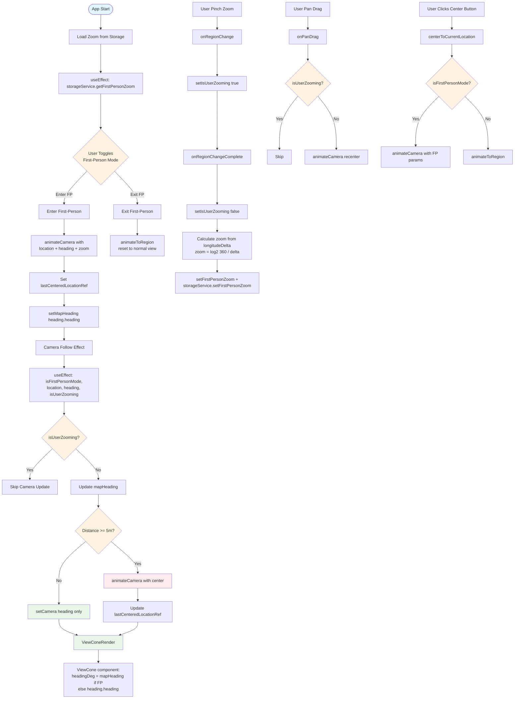

# First-Person Map Bugs And Fixes

## Initial Issues
- First-person used the same `MapView` camera update pattern as third-person, so the `ViewCone` rotated with the device rather than staying aligned to the top of the screen.
- `animateCamera` ran on every heading update and during pinch, which fought native zoom gestures and caused jitter.
- Drag detection relied on region deltas instead of explicit pan events, causing delayed or inconsistent recentering.
- All heading updates used animation, so rotation felt laggy.

## Final Behavior
- First-person keeps the cone visually fixed to screen-up while the map rotates underneath it.
- Pinch zoom is stable and persisted, and does not get interrupted by programmatic updates.
- Pan is immediately canceled by recentering, so dragging has no lasting effect.
- Recentering only happens after moving ~5 meters.
- Rotation updates are responsive (no animation), while large movements/transitioning use animation.

## Implementation Notes (Code Path)
- Entry point is `mobile/app/game.tsx`.

### State/Refs Used
- `isFirstPersonMode`: toggles first-person behavior and map gesture flags.
- `firstPersonZoom`: persisted zoom level for first-person; stored via `storageService`.
- `isUserZooming`: blocks camera recenter/heading updates while a gesture is active.
- `mapHeading`: drives the `ViewCone` heading in first-person.
- `lastCenteredLocationRef`: last location used to center the map; used to enforce the 5m threshold.

### First-Person Camera Follow
- Effect: `useEffect` watching `[isFirstPersonMode, location, heading, isUserZooming]`.
- Behavior:
  - If `isUserZooming` is true, skip camera updates to avoid fighting pinch zoom.
  - Compute distance from `lastCenteredLocationRef` to current `location`.
  - If distance >= `FIRST_PERSON_RECENTER_DISTANCE_METERS` (5m), update `center` and animate.
  - Otherwise, update only heading with `setCamera` (no animation) for low-latency rotation.

### Zoom Handling
- `onRegionChange` sets `isUserZooming = true` (only in first-person).
- `onRegionChangeComplete` clears the flag and converts `longitudeDelta` to a zoom level:
  - `zoom = round(log2(360 / longitudeDelta))`
  - Update `firstPersonZoom` and persist via `storageService`.

### Drag Handling
- `onPanDrag` immediately recenters via `animateCamera` so pan has no lasting effect.
- Guarded by `isUserZooming` to avoid interrupting pinch.

### ViewCone Heading
- In first-person, `ViewCone` uses `mapHeading` instead of `heading.heading` directly.
- `mapHeading` is updated when entering first-person and on normal heading updates in the follow effect.
- In third-person, `ViewCone` uses `heading.heading` as before.

### Enter/Exit Transitions
- Entering first-person: `animateCamera(..., { duration: 350 })`.
- Exiting first-person: `animateToRegion(..., 350)`.

## Logic Flow Diagram



## Code Reference

### 1. Initialization & State

状态声明：

```40:47:mobile/app/game.tsx
  // fp
  const [isFirstPersonMode, setIsFirstPersonMode] = useState(false);
  const [firstPersonZoom, setFirstPersonZoom] = useState(18);
  const [isUserZooming, setIsUserZooming] = useState(false);
  const [mapHeading, setMapHeading] = useState(0);
  const mapRef = useRef<MapView>(null);
  const cameraRef = useRef<Camera | null>(null);
  const lastCenteredLocationRef = useRef<{ latitude: number; longitude: number } | null>(null);
```

从存储加载缩放级别：

```50:55:mobile/app/game.tsx
  // =============== Init First Personal Mode ===============
  useEffect(() => {
    (async () => {
      const zoom = await storageService.getFirstPersonZoom();
      setFirstPersonZoom(zoom);
    })();
  }, []);
```

常量定义：

```25:25:mobile/app/game.tsx
const FIRST_PERSON_RECENTER_DISTANCE_METERS = 5;
```

### 2. Mode Toggle

切换第一人称模式的完整函数：

```217:246:mobile/app/game.tsx
  // 切换第一人称模式
  const toggleFirstPersonMode = useCallback(async () => {
    const newMode = !isFirstPersonMode;
    setIsFirstPersonMode(newMode);
    await storageService.setFirstPersonEnabled(newMode);

    if (!newMode && mapRef.current) {
      // 退出第一人称时，重置地图跟随
      mapRef.current.animateToRegion({
        latitude: location?.latitude ?? 52.145765,
        longitude: location?.longitude ?? -8.641198,
        latitudeDelta: 0.01,
        longitudeDelta: 0.01,
      }, 350);
    } else if (newMode && mapRef.current && location && heading) {
      lastCenteredLocationRef.current = {
        latitude: location.latitude,
        longitude: location.longitude,
      };
      mapRef.current.animateCamera({
        center: {
          latitude: location.latitude,
          longitude: location.longitude,
        },
        heading: heading.heading,
        pitch: 0,
        altitude: 0,
        zoom: firstPersonZoom,
      });
    }
  }, [isFirstPersonMode, location, heading, firstPersonZoom]);
```

### 3. Camera Follow Logic

相机跟随的核心 effect：

```107:138:mobile/app/game.tsx
  useEffect(() => {
    if (!isFirstPersonMode || !location || !heading || !mapRef.current) return;

    if (isUserZooming) return;

    setMapHeading(heading.heading);

    const shouldRecenter =
      !lastCenteredLocationRef.current ||
      calculateDistance(lastCenteredLocationRef.current, location) >=
        FIRST_PERSON_RECENTER_DISTANCE_METERS;

    const cameraUpdate: Partial<Camera> = {
      heading: heading.heading,
      pitch: 0,
    };

    if (shouldRecenter) {
      cameraUpdate.center = {
        latitude: location.latitude,
        longitude: location.longitude,
      };
      lastCenteredLocationRef.current = {
        latitude: location.latitude,
        longitude: location.longitude,
      };
      mapRef.current.animateCamera(cameraUpdate);
      return;
    }

    mapRef.current.setCamera(cameraUpdate as Camera);
  }, [isFirstPersonMode, location, heading, isUserZooming]);
```

### 4. Zoom Handling

区域变化开始（检测缩放手势）：

```173:181:mobile/app/game.tsx
  const handleRegionChange = useCallback(
    (_region: any, details?: { isGesture?: boolean }) => {
      if (!isFirstPersonMode) return;
      if (details?.isGesture) {
        setIsUserZooming(true);
      }
    },
    [isFirstPersonMode]
  );
```

区域变化完成（保存缩放级别）：

```183:198:mobile/app/game.tsx
  const handleRegionChangeComplete = useCallback(async (region: any) => {
    if (!isFirstPersonMode) return;

    setIsUserZooming(false);

    const zoomFromLongitudeDelta = (longitudeDelta: number) => {
      if (!longitudeDelta || longitudeDelta <= 0) return null;
      return Math.round(Math.log2(360 / longitudeDelta));
    };

    const nextZoom = zoomFromLongitudeDelta(region.longitudeDelta);
    if (nextZoom !== null) {
      setFirstPersonZoom(nextZoom);
      await storageService.setFirstPersonZoom(nextZoom);
    }
  }, [isFirstPersonMode]);
```

### 5. Drag Handling

拖拽处理（立即重新居中）：

```200:214:mobile/app/game.tsx
  const handlePanDrag = useCallback(() => {
    if (!isFirstPersonMode || !location || !heading || !mapRef.current) return;
    if (isUserZooming) return;

    mapRef.current.animateCamera({
      center: {
        latitude: location.latitude,
        longitude: location.longitude,
      },
      heading: heading.heading,
      pitch: 0,
      altitude: 0,
      zoom: firstPersonZoom,
    });
  }, [isFirstPersonMode, location, heading, firstPersonZoom]);
```

### 6. Manual Recenter

手动居中按钮处理：

```248:276:mobile/app/game.tsx
  const centerToCurrentLocation = useCallback(() => {
    if (!location || !mapRef.current) return;

    if (isFirstPersonMode && heading) {
      // 第一人称模式下，使用 animateCamera
      lastCenteredLocationRef.current = {
        latitude: location.latitude,
        longitude: location.longitude,
      };
      mapRef.current.animateCamera({
        center: {
          latitude: location.latitude,
          longitude: location.longitude,
        },
        heading: heading.heading,
        pitch: 0,
        altitude: 0,
        zoom: firstPersonZoom,
      });
    } else {
      // 普通模式下，使用 animateToRegion
      mapRef.current.animateToRegion({
        latitude: location.latitude,
        longitude: location.longitude,
        latitudeDelta: 0.01,
        longitudeDelta: 0.01,
      });
    }
  }, [location, heading, isFirstPersonMode, firstPersonZoom]);
```

### 7. ViewCone Rendering

ViewCone 组件使用：

```386:394:mobile/app/game.tsx
        {/* ViewCone */}
        {location && heading && (
          <ViewCone
            center={location}
            headingDeg={isFirstPersonMode ? mapHeading : heading.heading}
            spanDeg={VIEW_CONE_SPAN}
            radiusMeters={VIEW_CONE_RADIUS}
            fillColor="rgba(0, 122, 255, 0.25)" // 随意调整
          />
        )}
```

ViewCone 组件实现：

```15:60:mobile/components/ViewCone.tsx
export default function ViewCone({
  center,
  headingDeg,
  spanDeg,
  radiusMeters,
  resolution = 50,
  fillColor = 'rgba(0, 122, 255, 0.20)',
}: ViewConeProps) {
  const coordinates = useMemo(() => {
    if (!center) return [];

    const points = [];
    points.push({ latitude: center.latitude, longitude: center.longitude });

    const step = spanDeg / resolution;
    const start = headingDeg - spanDeg / 2;

    for (let i = 0; i <= resolution; i++) {
      const angle = start + i * step;
      const theta = (angle * Math.PI) / 180;

      const dLat = (radiusMeters * Math.cos(theta)) / METERS_PER_DEG_LAT;
      const metersPerDegLng = METERS_PER_DEG_LAT * Math.cos((center.latitude * Math.PI) / 180);
      const dLng = (radiusMeters * Math.sin(theta)) / metersPerDegLng;

      points.push({
        latitude: center.latitude + dLat,
        longitude: center.longitude + dLng,
      });
    }

    points.push(points[0]); // close
    return points;
  }, [center, headingDeg, spanDeg, radiusMeters, resolution]);

  if (coordinates.length < 3) return null;

  return (
    <Polygon
      coordinates={coordinates}
      fillColor={fillColor}
      strokeColor="rgba(0,0,0,0)"
      strokeWidth={0}
    />
  );
}
```

### 8. Map Configuration

MapView 配置：

```365:381:mobile/app/game.tsx
      <MapView
        ref={mapRef}
        style={mapStyles.map}
        mapType="none"
        initialRegion={{
          latitude: location?.latitude ?? 52.145765,
          longitude: location?.longitude ?? -8.641198,
          latitudeDelta: 0.01,
          longitudeDelta: 0.01,
        }}
        showsUserLocation={true}
        followsUserLocation={false}
        rotateEnabled={!isFirstPersonMode}
        zoomEnabled={true}
        onRegionChange={handleRegionChange}
        onRegionChangeComplete={handleRegionChangeComplete}
        onPanDrag={handlePanDrag}
      >
```

### 9. Storage Service

缩放级别持久化：

```36:43:mobile/services/storageService.ts
  async setFirstPersonZoom(zoom: number): Promise<void> {
    await AsyncStorage.setItem(STORAGE_KEYS.FIRST_PERSON_ZOOM, zoom.toString());
  }

  async getFirstPersonZoom(): Promise<number> {
    const zoom = await AsyncStorage.getItem(STORAGE_KEYS.FIRST_PERSON_ZOOM);
    return zoom ? parseFloat(zoom) : 18;
  }
```

模式状态持久化：

```45:52:mobile/services/storageService.ts
  async setFirstPersonEnabled(enabled: boolean): Promise<void> {
    await AsyncStorage.setItem(STORAGE_KEYS.FIRST_PERSON_ENABLED, enabled.toString());
  }

  async getFirstPersonEnabled(): Promise<boolean> {
    const enabled = await AsyncStorage.getItem(STORAGE_KEYS.FIRST_PERSON_ENABLED);
    return enabled === 'true';
  }
```
